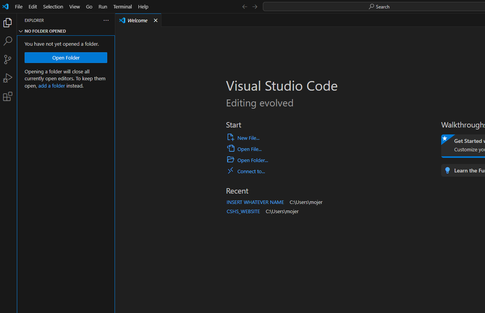
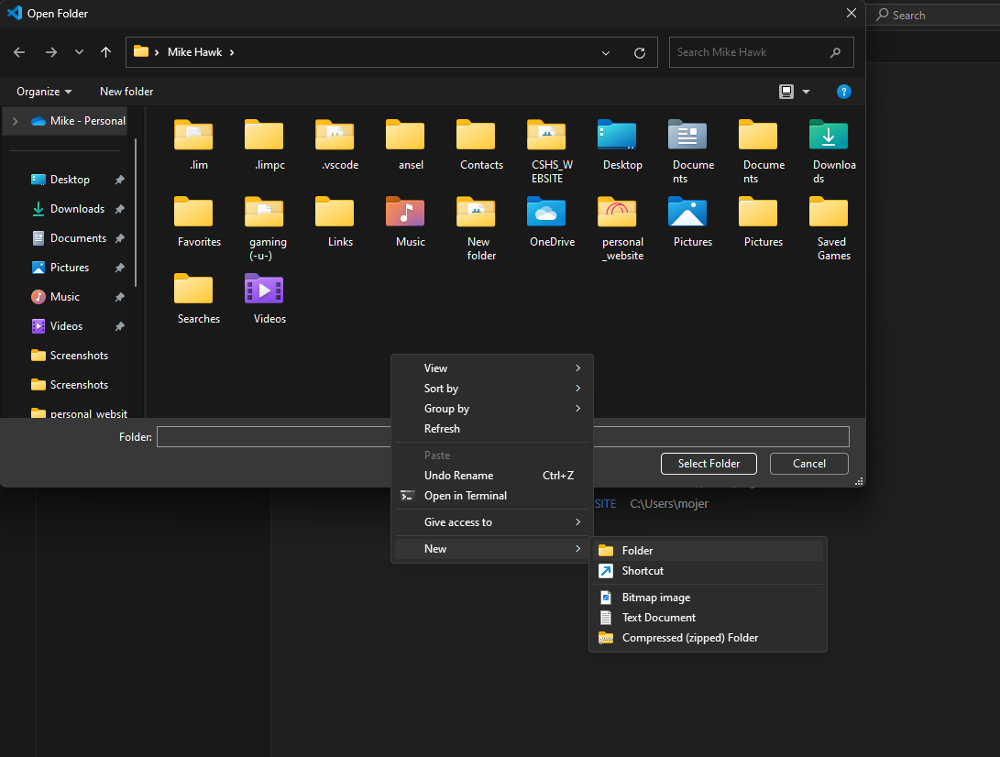
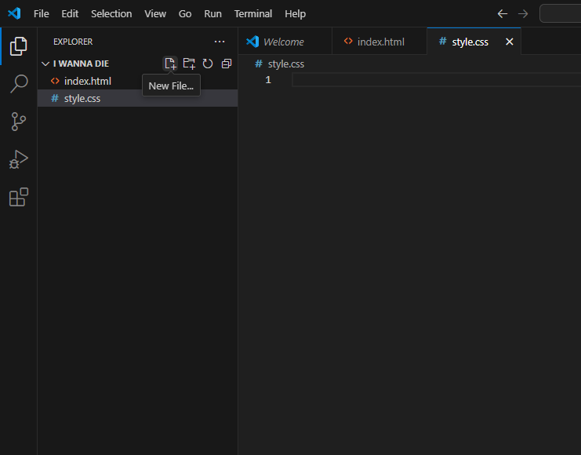
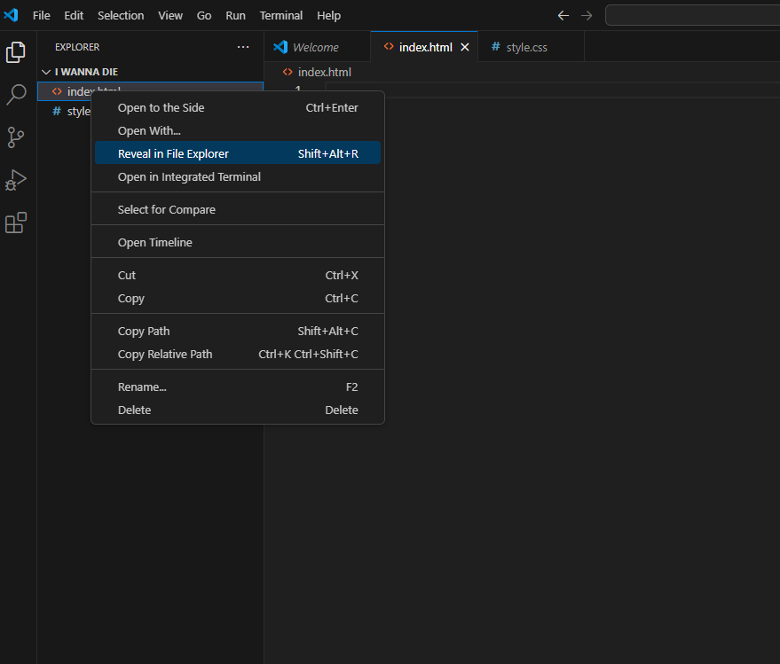

# HOW TO USE VS CODE

### FIRST -> DOWNLOAD VS CODE (https://code.visualstudio.com)

## Then, you should have an editor like this ->

This editor is where you are going to be coding your/our website. THIS WILL BE SERVER SIDDED SO PLEASE TALK TO ONE ANOTHER BEFORE UPLOADING ONTO GITHUB. Other than that, you first ahve to make your first file. To do that you hit the big ***OPEN FOLDER*** button, then create a folder like this:
##

##
### AFTER MAKING THIS FILE -> open it (duh)

This is where you put all images as well as your files for the website. To first add on onto your file, create an ***index.html*** as well as an ***style.css*** file by doing this:
##

### FINALLY YOU CAN EDIT YOUR WEBSITE!!!
Just add whatever you need inside the html as well as the css file to edit real time! PLease double check for anny errors his way to see if you can impolement the website to the main website. Just dont forget to ->
### HIT (CTRL -> s) TO SAVE YOUR PROGRESS

## to view the website...
### open up the file view going through your file explorer and double clicking the html file ->

# AND THERE YOU HAVE IT!!! HOW TO USE VS CODE AND VIEW YOUR WEBSITE
